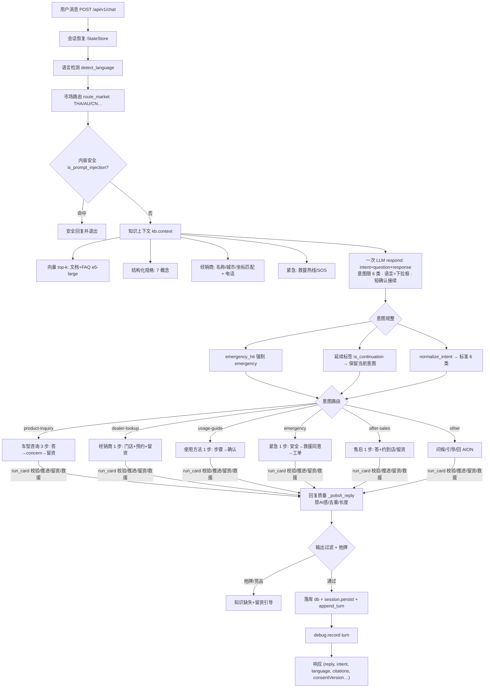

# 对话系统整体流程图（as-built）

> 覆盖：从用户消息到最终响应的完整链路 + 关键分支（意图、紧急、跑题、他牌、转人工）。
> 图例：圆角矩形=处理步骤；菱形=判断分支；→=流转。

## 关键分支说明
| 分支 | 判断 | 去向 |
|---|---|---|
| 紧急 | `emergency_hit` 强信号 | 强制 `emergency` 卡（安全确认 → 救援同意 → 工单） |
| 延续 | LLM 返回 `accept_offer_continue/agree/确认` 等 | 保留会话当前业务意图，接上刚才话题 |
| 跑题/无关 | 天气/新闻/生活等 | re-anchor 桥接回 AION |
| 他牌/竞品 | `find_competitor` | 只推 AION + 知识缺失留资引导 |
| 意向不明 | 意图低置信、非业务 | 澄清(A/B/C/D) → 超限转人工 |
| 槽位收不到 | `SLOT_MAX_ASK` | 转人工一次 |
| 知识检索 | 各数据源 | 文档/FAQ(向量) + 规格(精确) + 经销商(名称/城市/坐标) + 紧急(救援) |

## 一句话
**消息 → 会话/语言/市场/安全 → RAG(向量+规格+经销商+救援) → 一次 LLM(意图+回答, 下拉语言) → 规整(延续/紧急) → 卡片状态机(推进/留资/救援) → 话术质量/过滤/他牌 → 落库持久化 → 响应(含来源引用)**。
